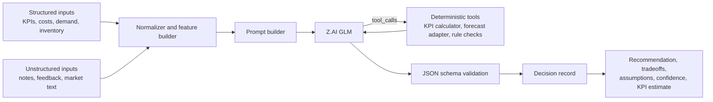
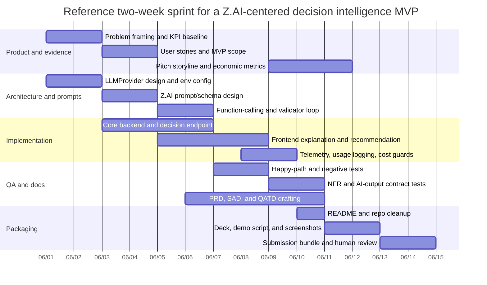

# Judge-Aligned GitHub Copilot Preprompt for a Z.AI-Centered UMHackathon Domain 2 Build

## Executive summary

For entity["company","GitHub","software company"] Copilot, the practical equivalent of a “preprompt” is not a hidden system message that you fully control. It is a layered instruction stack: a repository-wide `.github/copilot-instructions.md`, optional path-specific `.github/instructions/*.instructions.md`, and reusable `.github/prompts/*.prompt.md` files. That matters here because UMHackathon Domain 2 is not rewarding generic AI app scaffolding; it is explicitly rewarding a decision intelligence system whose core reasoning depends on entity["company","Z.ai","ai platform"] GLM, with measurable economic impact, explainability, and strong engineering execution. citeturn6view0turn9view1turn9view3 fileciteturn0file1 fileciteturn0file3

The most important implication is compliance. Domain 2 requires Z.AI’s GLM to play a central role in interpreting structured and unstructured data, generating context-aware insights, recommending actions, and explaining decisions. The judging sheet is even stricter: using the Z AI model is mandatory for eligibility, and using another reasoning model is disqualifying. A good Copilot preprompt therefore has to do more than “help with code.” It must continuously steer the team away from non-compliant architecture, shallow automation, and unverifiable claims. fileciteturn0file1 fileciteturn0file3

The preprompt also has to be submission-aware. The official handbook requires a preliminary-round package containing a PRD, SAD, code repository, QA testing document, pitch deck, and a 10-minute pitching video, with all external references cited. Submission happens only through the official website, and once a team submits, no changes are entertained. The participant handbook adds that each team has only one irreversible submission attempt. That means Copilot should be instructed to optimize for reproducible artifacts, packaging discipline, citation hygiene, and human review gates before anything is marked “final.” fileciteturn0file4 fileciteturn0file5 fileciteturn0file7

The reviewed ILMU materials should be treated as important, but carefully. ILMU’s official docs and console present it as a Malaysian-hosted, OpenAI-compatible inference platform built by entity["organization","YTL AI Labs","malaysia ai lab"], with Malaysia-only data processing, JSON mode, streaming, function calling, and local usage monitoring. However, the reviewed ILMU docs currently surface `nemo-super` and `ilmu-nemo-nano` as the documented model catalogue, not GLM. Because the hackathon rules are explicit about Z.AI GLM, direct Z.AI is the lowest-risk judge-facing runtime path; ILMU is best treated as an integration reference, a Malaysia-residency deployment reference, or an optional non-judge-path adapter unless the organizers explicitly confirm an approved GLM route through it. citeturn7view4turn6view4turn7view5turn14search2turn14search8turn11view0 fileciteturn0file1 fileciteturn0file3

The upshot is simple: the highest-utility Copilot setup for this project is a judge-aware instruction system that makes Z.AI GLM non-negotiable, turns Copilot into a blended developer/architect/tester/documentarian/prompt engineer, forces artifact completeness, and makes every proposed change legible against the rubric. That is what the report below is designed to produce. fileciteturn0file3 fileciteturn0file4

## Source-grounded requirements that the preprompt must enforce

The judging math strongly shapes the preprompt. The preliminary-round rubric allocates 30% to product thinking and problem design, 45% to technical architecture and engineering execution, 10% to quality assurance, and 15% to communication and user experience. In other words, a Copilot setup that only optimizes coding throughput misses most of the score. The instruction set must teach Copilot to generate strong product framing, architecture narratives, modular code, QA evidence, and pitch-ready explanations together, not separately. fileciteturn0file3

The hackathon’s own sample templates make that even clearer. The PRD sample explicitly asks teams to state the Z AI GLM choice and its justification, the prompting strategy, context and oversized-input handling, fallback and hallucination behavior, and LLM cost constraints. The SAD sample explicitly requires the architecture to show GLM as a service layer, including prompt construction, context-window contents, response parsing, token-limit enforcement or chunking, and major system/API interactions. The QATD sample requires requirements traceability, a 5x5 risk matrix, CI/CD thresholds, happy/negative/NFR test cases, and AI prompt/response validation. A high-utility Copilot preprompt has to force these sections into any relevant draft before the team remembers them manually. fileciteturn0file6 fileciteturn0file0 fileciteturn0file8

Operationally, the preprompt also needs to compensate for what the event does **not** provide. The FAQ says cloud services are not provided, datasets are not provided, and teams may use any language they are comfortable with. The official handbook says all work in the final submission must be done during the official round, all external resources must be cited, public source links are highly encouraged, and submissions must remain exclusive to this event. For the actual team, stack choice and team size remain unspecified, so the preprompt should act in a role-based, parameterized way rather than assume a fixed technology or headcount. fileciteturn0file2 fileciteturn0file4 fileciteturn0file7

A strong Copilot configuration for this competition should therefore remember the following design truths at all times.

| Preprompt obligation | Why it is non-negotiable |
|---|---|
| Keep Z.AI GLM in the core decision loop | Domain 2 says the system should lose meaningful insight generation if GLM is removed |
| Optimize for decision intelligence, not generic automation | Judges want reasoning, insights, recommendations, explainability, and quantifiable impact |
| Treat docs and tests as first-class outputs | PRD, SAD, QATD, code repo, pitch deck, and video are all part of scoring |
| Force measurable KPIs and validation | The brief asks for time saved, cost reduction, revenue improvement, and basic validation |
| Preserve one-shot submission discipline | Submission is effectively locked after the final upload |
| Keep citations and exclusivity visible | Missing attribution or re-used content can create disqualification risk |

This table is a direct synthesis of the Domain 2 brief, judging rubric, handbook, participant handbook, and sample templates. fileciteturn0file1 fileciteturn0file3 fileciteturn0file4 fileciteturn0file5 fileciteturn0file6 fileciteturn0file8

## Recommended platform strategy and architecture pattern

For this project, the best Copilot strategy is a **layered instruction architecture**:

- a small, compliance-heavy repo-wide core in `.github/copilot-instructions.md`
- path-specific instruction files for docs, tests, and provider code
- prompt files for repeatable tasks such as drafting the SAD, generating test cases, or packaging the submission
- an optional `AGENTS.md` mirror if the team uses agent-style Copilot features or the CLI

That layered approach is grounded in the way Copilot customization actually works. GitHub’s docs distinguish repo-wide custom instructions, path-specific instructions with `applyTo` globs, prompt files stored under `.github/prompts/*.prompt.md`, and optional `AGENTS.md` files for agent workflows. GitHub also explicitly notes that Copilot behavior is non-deterministic, which is another reason to keep the repo-wide file focused on high-level rules and move detailed task logic into narrower instruction files and prompt files. citeturn6view0turn6view1turn9view1turn9view3

The provider choice should be framed the same way: through a narrow abstraction that keeps the judge-facing path clean.

| Option | What the reviewed official sources show | Compliance implication | Recommended role |
|---|---|---|---|
| Direct Z.AI | Native GLM API, standard HTTP endpoint, OpenAI-SDK compatibility, chat completions, function calling, structured output, token usage in responses, and current GLM families such as 4.5, 4.6, 4.7, and 5.x | Lowest-risk interpretation of “Z AI Model is mandatory” | Primary runtime and demo path |
| ILMU | Malaysian infrastructure, Malaysia-only data processing, OpenAI-compatible base URL, JSON mode, tool calling, streaming, usage dashboard, and documented model IDs `nemo-super` and `ilmu-nemo-nano` | Risky if used as the core reasoning engine because the reviewed docs do not document GLM as the exposed model family | Optional compatibility adapter, local-residency reference, or non-judge-path experiment only unless organizers confirm GLM access through it |
| Other non-Z.AI providers | Technically replaceable behind an abstraction in many codebases, but not aligned to the competition rule | Disqualifying if used for primary reasoning in the submitted product | Avoid in the shipped judge path; at most use local mocks or fixtures outside runtime |

This comparison is derived from the official Z.AI docs, the reviewed ILMU docs and console, and the explicit hackathon rules. The “lowest-risk” and “risky” judgments are analytical inferences from those sources, not organizer quotes. citeturn6view3turn13view0turn13view1turn13view2turn7view4turn6view4turn7view5turn14search8turn11view0 fileciteturn0file1 fileciteturn0file3

A runtime architecture that will satisfy both the Domain 2 brief and the SAD template should make GLM visibly central while still offloading deterministic math and validation to ordinary code. Z.AI and ILMU both support function calling, and Z.AI supports structured outputs plus usage reporting, so the cleanest pattern is: normalize inputs, ask GLM to reason and decide, call deterministic tools for KPI calculations or forecasts when needed, validate the JSON response, then store and display a concise explanation object instead of raw reasoning traces. citeturn6view7turn13view2turn15view3turn7view5 fileciteturn0file0 fileciteturn0file1



Keep token, latency, and cost logic configurable. Official Z.AI docs show materially different context and output limits across model families: GLM-4.5 has 128K context and up to 96K output; GLM-4.6 and GLM-4.7 expose 200K context and up to 128K output; the `thinking` feature increases reasoning quality but also increases response time and token consumption. Z.AI responses expose `prompt_tokens`, `completion_tokens`, and `total_tokens`, which makes per-call cost monitoring straightforward. ILMU’s reviewed docs show 256K context and 128K max output on its documented models, plus a 4 MB request-body limit. ILMU’s prompt-engineering guide also explicitly recommends low temperature for code and structured-output tasks, always using a system prompt, and keeping few-shot examples short. The right preprompt should therefore force Copilot to keep model IDs and limits in environment variables, chunk large inputs, log usage, and default to deterministic settings for code and JSON tasks. citeturn18view0turn18view1turn18view2turn13view2turn12view0turn7view7turn14search2turn6view5

## Full repo-wide preprompt ready to paste

The following text is designed for `.github/copilot-instructions.md`, which GitHub documents as the repository-wide custom instructions file. It is intentionally written as persistent operational guidance rather than as a one-off chat prompt. It encodes the Domain 2 brief, the scoring rubric, the document-template expectations, and the one-shot submission reality into a single reusable Copilot operating contract. citeturn6view0turn9view3 fileciteturn0file1 fileciteturn0file3 fileciteturn0file4 fileciteturn0file5

```md
# Copilot operating instructions for this repository

You are assisting a hackathon team building an AI-powered decision intelligence system for UMHackathon Domain 2.

Your purpose is to accelerate implementation, architecture, testing, documentation, and submission packaging while preserving strict hackathon compliance and technical honesty.

## Mission

Help this repository produce a judge-aligned MVP in which Z.AI GLM is the primary reasoning engine for decision support.

The product must visibly demonstrate all of the following:
- interpretation of structured and unstructured inputs
- context-aware reasoning and insight generation
- recommendation of actions, strategies, or tradeoffs
- user-understandable explanation of decisions
- measurable economic impact with explicit KPI formulas or estimates

Do not treat the model as a cosmetic chatbot or summarizer. The model must sit in the core decision path.

## Active personas

Switch between these personas as needed, without being asked to rename yourself:
- Senior full-stack developer
- Systems architect
- QA / test engineer
- Technical writer
- Prompt engineer
- Submission packager

When a task is ambiguous, choose the persona most likely to move the repository toward a complete, judged submission.

## Non-negotiable compliance rules

1. Treat Z.AI GLM as the only allowed core reasoning model in the shipped product path.
2. Do not propose replacing runtime reasoning with any non-Z.AI model in architecture, code, docs, prompts, pitch content, or README text.
3. If asked for an alternative provider, only offer:
   - mocks
   - contract-test doubles
   - optional adapters clearly labeled as NON-JUDGE-PATH
   - fallback heuristics that preserve app functionality without claiming the same reasoning capability
4. Never silently swap providers.
5. If the repository includes an ILMU adapter, treat it as optional and disabled by default unless the repository explicitly documents organizer approval for GLM access through ILMU.
6. Never hardcode secrets, API keys, tokens, or private links.
7. Never invent unknown competition facts, model access, pricing, benchmarks, or team decisions.
8. Always mark unknown items as `UNSPECIFIED` and assumptions as `ASSUMPTION`.
9. Never present copied third-party code or text as original work. If something appears externally derived, flag it for citation/review.
10. Never assume the final submission can be edited later. Treat “ready” as final-ready.

## Architecture rules

Always prefer a provider abstraction over direct model calls scattered throughout the codebase.

Required pattern:
- business logic stays separate from provider clients
- provider clients stay separate from prompt builders
- prompt builders stay separate from schema validators
- validators stay separate from UI rendering

Preferred abstraction names:
- `LLMProvider`
- `ZAIProvider`
- optional `ILMUProvider`
- `DecisionEngine`
- `PromptBuilder`
- `DecisionSchemaValidator`
- `UsageLogger`

Preferred request flow:
1. ingest structured + unstructured inputs
2. normalize / summarize / feature-build in deterministic code
3. build a decision prompt
4. call ZAIProvider
5. parse JSON
6. validate schema
7. run deterministic KPI calculations if needed
8. return a typed decision object
9. persist the recommendation, assumptions, confidence, and usage metadata

## Runtime output contract

For user-facing decision results, prefer a schema like this:

- `recommendation`
- `alternative_actions`
- `explanation_summary`
- `key_factors`
- `tradeoffs`
- `assumptions`
- `missing_inputs`
- `confidence`
- `economic_impact`
- `validation_notes`
- `next_step`

Do not expose raw chain-of-thought as the primary explanation.
Prefer concise rationales, factor lists, tradeoffs, assumptions, and confidence.

## Coding rules

When generating code:
- make the smallest viable change that satisfies the request
- produce runnable code unless explicitly asked for pseudocode
- preserve existing conventions if the repository already has them
- add type hints or strict typing where appropriate
- validate all external inputs
- add explicit error handling
- use environment variables for configuration
- log request IDs, token usage, latency, and status where available
- keep model name, base URL, max tokens, and provider selectable through config
- do not hardcode a specific GLM model unless it is already configured in the repo
- chunk, truncate, summarize, or reject oversized inputs before sending them to the model
- write defensive parsing for model JSON
- keep deterministic math in code, not in free-form model output

## Prompt engineering rules

When generating prompts for the runtime model:
- always use a system prompt
- keep the task specific and measurable
- ask for JSON when the next component expects machine-readable output
- instruct the model not to fabricate unknown values
- require the model to surface missing inputs and assumptions
- prefer low-temperature settings for code, extraction, validation, and structured decision output
- keep few-shot examples short and targeted
- treat reasoning mode as configurable per task

Use model thinking for:
- multi-constraint planning
- tradeoff analysis
- strategy generation
- ambiguous decision support
- technical design assistance

Disable or avoid heavy reasoning for:
- trivial transformations
- formatting-only tasks
- simple classifications
- deterministic calculations already handled in code

## Documentation rules

Whenever you draft or revise documents, optimize for judges, not generic internal docs.

### PRD requirements
Always include:
- problem statement
- target users
- business objective and impact
- high-priority MVP features
- out-of-scope items
- why Z.AI GLM is required
- prompting strategy
- input/context handling
- fallback/failure behavior
- performance and cost constraints
- assumptions, open questions, and risks

### SAD requirements
Always include:
- high-level architecture
- GLM as a service layer, not a vague AI box
- prompt construction
- context-window contents
- token-limit enforcement or chunking
- response parsing and validation
- sequence flow for at least one core user journey
- major API interactions
- service/database/external dependency interactions
- deployment and monitoring considerations

### QATD requirements
Always include:
- scope and requirement traceability
- 5x5 risk matrix
- test environments and execution strategy
- CI / CD quality gates
- happy-path test
- negative or edge-case test
- non-functional tests
- AI-output tests with acceptance criteria
- pass/fail thresholds

### README requirements
Always include:
- project overview
- architecture summary
- setup instructions
- environment variables
- how to run tests
- demo flow
- compliance note explaining where Z.AI GLM is used
- KPI or impact summary
- limitations and fallback mode
- repository structure

## Testing rules

When adding tests, always cover:
- one end-to-end happy path
- one invalid-input or missing-data path
- one provider failure path
- one schema-validation failure path
- one non-functional check (latency, payload size, or token usage)
- one AI-output contract test

AI-output tests should check:
- valid JSON format
- required keys present
- no fabricated numeric fields when inputs are missing
- explanation fields are populated
- recommendation is aligned with the available evidence
- economic impact object follows the schema
- graceful failure on unusable output

## CI / CD rules

Assume the repository should have automated checks for:
- install / build
- lint / format
- test execution
- coverage or test reports
- artifact packaging
- document generation if docs are source-based
- manual packaging for final submission review

Do not suggest auto-submitting to the hackathon website.
It is acceptable to automate packaging, validation, and artifact generation only.

## Security and privacy rules

- never commit secrets
- never place provider API keys in client-side code
- prefer server-side model calls
- redact sensitive values from logs
- avoid storing raw prompts/responses unless necessary for debugging
- if storing prompts or outputs, keep a minimal audit record
- make privacy-sensitive behavior configurable

## Cost and performance rules

Always think about token usage, latency, and prompt size.
When relevant:
- estimate token cost per session
- reduce repeated context
- cache stable context where appropriate
- keep prompts concise
- separate heavy reasoning calls from lightweight formatting calls
- log `prompt_tokens`, `completion_tokens`, and `total_tokens`
- show where costs are measured in code and docs

## Submission-awareness rules

Treat every major artifact as if it may go into the final irreversible submission bundle.
Before declaring anything “complete,” check for:
- consistent naming
- working repo links
- environment variable documentation
- diagram/document alignment with code
- citations needed for external sources
- final file list completeness
- README accuracy
- no placeholder claims left unmarked

## Rejection behavior

If a request conflicts with the repository mission, do not comply silently.
Instead:
1. explain the conflict briefly
2. provide the closest compliant alternative
3. continue the task in the compliant direction

Examples:
- If asked to replace Z.AI GLM with another reasoning model, refuse the swap and provide a compliant abstraction pattern instead.
- If asked to invent KPI values, provide formulas, assumptions, and placeholders instead.
- If asked to hide missing data, surface `missing_inputs` and degrade gracefully instead.
- If asked to skip explanation fields, explain that explainability is required and include them.
- If asked to automate submission to the official website, refuse and generate a submission package/checklist instead.

## Preferred response format

For non-trivial tasks, structure your output as:
- objective
- assumptions / unspecified items
- recommended approach
- code / docs / tests
- risk notes
- judge-alignment notes

Keep answers direct, implementation-oriented, and repository-aware.
```

If you want stronger adherence than a single repo-wide file can usually deliver, split the longer sections into path-specific instruction files. GitHub supports `.github/instructions/*.instructions.md` with `applyTo` globs, and its own docs warn that Copilot behavior is non-deterministic. In practice, the repo-wide file should carry the compliance core, while docs/test/provider specifics move into narrower files. citeturn6view0turn6view1turn9view1

## Supporting prompt files, runtime prompt patterns, and repository templates

### Prompt file starters for repeatable work

GitHub’s prompt files are the right place for repeated one-off tasks such as “draft the SAD section for this service” or “generate contract tests for the provider layer.” Official docs place them under `.github/prompts/*.prompt.md`, describe them as reusable standalone templates, and note that they are currently in public preview and only available in VS Code, Visual Studio, and JetBrains IDEs. They work best when combined with file references and project context. citeturn9view3turn6view2turn9view2

| Suggested prompt file | Use it for | Starter intent |
|---|---|---|
| `.github/prompts/implement-zai-endpoint.prompt.md` | Code generation | Implement or refactor a server-side Z.AI endpoint using the provider abstraction, typed schemas, retries, and usage logging |
| `.github/prompts/build-llm-provider.prompt.md` | API client abstraction | Create or update `LLMProvider`, `ZAIProvider`, and optional `ILMUProvider` adapters without changing business logic |
| `.github/prompts/draft-prd.prompt.md` | PRD drafting | Draft or refine the PRD around users, MVP scope, GLM role, prompting strategy, fallback, and KPI economics |
| `.github/prompts/draft-sad.prompt.md` | SAD drafting | Produce GLM-centered architecture content, sequence logic, data flows, token handling, and deployment notes |
| `.github/prompts/draft-qatd.prompt.md` | QA/testing document | Build risk matrix, traceability, CI gates, AI test pairs, and NFR tests |
| `.github/prompts/generate-tests.prompt.md` | Test-case generation | Add happy-path, negative, NFR, and AI-output contract tests for a selected file or service |
| `.github/prompts/setup-ci-cd.prompt.md` | CI/CD | Create or refine GitHub Actions for build, test, doc export, and submission packaging |
| `.github/prompts/zai-json-schema.prompt.md` | Prompt engineering | Create a system prompt and matching JSON schema for a decision output object |
| `.github/prompts/deploy-zai.prompt.md` | Z.AI deployment | Add environment variables, server-side client setup, retries, and observability for direct Z.AI |
| `.github/prompts/deploy-ilmu-nonjudge.prompt.md` | ILMU compatibility work | Add an ILMU-compatible adapter or dev environment with a compliance warning and disabled-by-default runtime path |
| `.github/prompts/create-readme.prompt.md` | README generation | Produce a judge-friendly README with setup, architecture, compliance note, tests, and demo flow |
| `.github/prompts/package-submission.prompt.md` | Final packaging | Build a manifest and checklist for PRD/SAD/QATD/Pitch/Video/Repo links before manual submission |

A particularly useful pattern is to keep one very small repo-wide rule and move high-detail doc logic into path-scoped files. For example:

```md
---
applyTo: "docs/**/*.md,docs/**/*.mdx,submission/**/*.md"
---
Write for judges, not internal engineers.
Always surface: target user, measurable impact, Z.AI GLM role, assumptions, risks, validation method, and citation placeholders.
Do not leave unsupported claims unmarked.
```

```md
---
applyTo: "src/llm/**/*.ts,src/llm/**/*.py,src/providers/**/*"
---
Preserve provider abstraction boundaries.
Do not mix business logic into provider files.
Always validate model JSON, log token usage, and fail safely on provider errors.
Never hardcode secrets or model limits.
```

### A runtime system prompt and few-shot pattern for Z.AI GLM

Official Z.AI docs support chat completions, function calling, structured output, and `thinking` controls, while the response schema includes `usage` fields and can surface tool calls. The ILMU prompt-engineering material adds a useful, generalizable rule for structured or code-like tasks: use a system prompt, keep the request specific, constrain output to JSON when required, and keep temperature low. citeturn13view1turn13view2turn6view7turn15view3turn18view0turn18view2turn6view5

A strong **system prompt** for a Domain 2 decision engine looks like this:

```text
You are the reasoning core of an economic decision intelligence system.

Your job is to analyze both structured metrics and unstructured notes, then recommend a decision that improves economic outcomes.

Rules:
- Return only valid JSON.
- Do not invent missing values.
- If required data is missing, populate missing_inputs and lower confidence.
- Provide a concise explanation_summary, not raw chain-of-thought.
- Surface key_factors, tradeoffs, assumptions, and validation_notes.
- If a deterministic calculation is needed, request the appropriate tool instead of guessing.
- Keep recommendations realistic for the target user and use case.
```

A compact **few-shot example** that teaches explainability without hallucinating looks like this:

```json
{
  "example_input": {
    "target_user": "SME retailer",
    "structured": {
      "weekly_sales": 4200,
      "holding_cost": 180,
      "stockout_rate": 0.14,
      "gross_margin_pct": 0.28
    },
    "unstructured": {
      "notes": "Demand spikes on weekends. Supplier lead time has become less reliable."
    }
  },
  "example_output": {
    "recommendation": "Increase reorder point for the top 20 percent of fast-moving SKUs and review weekend safety stock weekly.",
    "alternative_actions": [
      "Keep reorder point unchanged and accept higher stockout risk",
      "Broaden stock increase across all SKUs"
    ],
    "explanation_summary": "Weekend demand spikes and supplier instability raise the chance of lost sales on high-velocity items, so a targeted reorder-point increase is the lowest-waste intervention.",
    "key_factors": [
      "Weekend demand spike",
      "Supplier lead-time variability",
      "Current stockout rate is elevated"
    ],
    "tradeoffs": [
      "Higher carrying cost on selected SKUs",
      "Lower lost-sales risk"
    ],
    "assumptions": [
      "Top-selling SKU ranking is stable over the next 2 to 4 weeks"
    ],
    "missing_inputs": [],
    "confidence": 0.79,
    "economic_impact": {
      "currency": "MYR",
      "estimated_cost_delta": 60,
      "estimated_revenue_delta": 260,
      "estimated_productivity_delta_pct": 4.5
    },
    "validation_notes": [
      "Impact estimate should be checked against last 4 weeks of SKU-level demand"
    ]
  }
}
```

### Z.AI GLM call pattern with JSON enforcement

For runtime product calls, use the **general** Z.AI API endpoint, not the coding endpoint, because the reviewed docs reserve the coding endpoint for supported coding tools and recommend the general endpoint for other use cases. Z.AI’s reviewed OpenAI-compatibility docs also show that existing OpenAI-style clients can be pointed at Z.AI by changing the base URL and API key, while chat-completion responses include a structured `usage` object. citeturn6view3turn13view0turn13view1turn13view2

```python
import os
import json
from openai import OpenAI
from jsonschema import validate

client = OpenAI(
    api_key=os.environ["ZAI_API_KEY"],
    base_url=os.getenv("ZAI_BASE_URL", "https://api.z.ai/api/paas/v4/"),
)

decision_schema = {
    "type": "object",
    "properties": {
        "recommendation": {"type": "string"},
        "alternative_actions": {"type": "array", "items": {"type": "string"}},
        "explanation_summary": {"type": "string"},
        "key_factors": {"type": "array", "items": {"type": "string"}},
        "tradeoffs": {"type": "array", "items": {"type": "string"}},
        "assumptions": {"type": "array", "items": {"type": "string"}},
        "missing_inputs": {"type": "array", "items": {"type": "string"}},
        "confidence": {"type": "number", "minimum": 0, "maximum": 1},
        "economic_impact": {
            "type": "object",
            "properties": {
                "currency": {"type": "string"},
                "estimated_cost_delta": {"type": "number"},
                "estimated_revenue_delta": {"type": "number"},
                "estimated_productivity_delta_pct": {"type": "number"}
            },
            "required": ["currency"]
        },
        "validation_notes": {"type": "array", "items": {"type": "string"}}
    },
    "required": [
        "recommendation",
        "explanation_summary",
        "key_factors",
        "tradeoffs",
        "assumptions",
        "missing_inputs",
        "confidence",
        "economic_impact",
        "validation_notes"
    ]
}

messages = [
    {
        "role": "system",
        "content": """
You are the reasoning core of an economic decision intelligence system.
Return only valid JSON that matches the provided schema.
Do not invent unknown values.
If required data is missing, list it in missing_inputs and reduce confidence.
Do not reveal raw chain-of-thought. Provide concise explanation_summary instead.
"""
    },
    {
        "role": "user",
        "content": json.dumps({
            "target_user": "SME retailer",
            "structured": {
                "weekly_sales": 4200,
                "holding_cost": 180,
                "stockout_rate": 0.14,
                "gross_margin_pct": 0.28
            },
            "unstructured": {
                "notes": "Demand spikes on weekends. Supplier lead time has become less reliable."
            },
            "required_schema": decision_schema
        })
    }
]

response = client.chat.completions.create(
    model=os.environ["GLM_MODEL"],  # e.g. glm-4.5, glm-4.6, glm-4.7 if available in your account
    messages=messages,
    response_format={"type": "json_object"},
    temperature=0.1,
    max_tokens=1200,
    extra_body={
        "thinking": {"type": "enabled"}
    }
)

payload = json.loads(response.choices[0].message.content)
validate(instance=payload, schema=decision_schema)

usage = response.usage  # prompt_tokens, completion_tokens, total_tokens
print(payload)
print(usage)
```

If you want a compatibility adapter for ILMU, keep it isolated and clearly non-judge-primary unless approved. The reviewed ILMU docs show an OpenAI-compatible base URL at `https://api.ilmu.ai/v1`, JSON mode, tool use, and a live usage dashboard, but also show that the currently documented model catalogue is ILMU-native rather than GLM-branded. citeturn14search4turn7view5turn14search2turn4search18

### Provider abstraction, repository layout, and build workflows

Because both Z.AI and ILMU expose OpenAI-style integration patterns in the reviewed docs, the right engineering move is not provider-coupled business logic. It is a narrow `LLMProvider` interface, a mandatory `ZAIProvider`, and an optional ILMU adapter protected by explicit compliance flags. citeturn13view0turn14search4turn4search18

A sensible folder structure for this hackathon repository is:

```text
.github/
  copilot-instructions.md
  instructions/
    docs.instructions.md
    llm.instructions.md
    qa.instructions.md
  prompts/
    implement-zai-endpoint.prompt.md
    build-llm-provider.prompt.md
    draft-prd.prompt.md
    draft-sad.prompt.md
    draft-qatd.prompt.md
    generate-tests.prompt.md
    setup-ci-cd.prompt.md
    create-readme.prompt.md
    package-submission.prompt.md
  workflows/
    ci.yml
    docs-export.yml
    package-submission.yml
    deploy-demo.yml
AGENTS.md                      # optional mirror for agent workflows
docs/
  prd/
  sad/
  qatd/
  pitch/
submission/
  checklist.md
  manifest.md
  links.md
src/
  app/
  domain/
  services/
  llm/
    provider.ts
    zai_provider.ts
    ilmu_provider.ts          # optional, disabled by default
    schemas/
  telemetry/
tests/
  unit/
  integration/
  ai_contract/
  e2e/
scripts/
  export_docs/
  package_submission/
```

A minimal provider contract can be kept small and strict:

```ts
export type DecisionInput = {
  targetUser: string;
  structured: Record<string, unknown>;
  unstructured: Record<string, unknown>;
};

export type DecisionOutput = {
  recommendation: string;
  explanation_summary: string;
  key_factors: string[];
  tradeoffs: string[];
  assumptions: string[];
  missing_inputs: string[];
  confidence: number;
  economic_impact: Record<string, unknown>;
  validation_notes: string[];
};

export type UsageMeta = {
  prompt_tokens?: number;
  completion_tokens?: number;
  total_tokens?: number;
  request_id?: string;
  latency_ms?: number;
};

export interface LLMProvider {
  readonly name: "zai" | "ilmu";
  generateDecision(input: DecisionInput): Promise<{
    output: DecisionOutput;
    usage: UsageMeta;
  }>;
  healthcheck(): Promise<boolean>;
}
```

The GitHub Actions side should automate **build, test, doc export, and package generation**, but not the final upload to the official submission website. GitHub’s docs require workflows to live in `.github/workflows`, support artifact upload/download, job dependencies via `needs`, and deployment controls via environments and protection rules. The hackathon rules, meanwhile, require submission through the official website only and make that final submission effectively irreversible. So the right design is “automate packaging, not submission.” citeturn10view0turn10view1turn10view2turn10view3 fileciteturn0file4 fileciteturn0file5

| Workflow | Trigger | Purpose |
|---|---|---|
| `ci.yml` | `push`, `pull_request` | Install, lint, type-check, run unit/integration tests, upload test and coverage artifacts |
| `docs-export.yml` | `push`, `workflow_dispatch` | Render PRD/SAD/QATD source docs into PDFs and upload them as artifacts for review |
| `ai-contract-tests.yml` | `push`, `pull_request` | Run schema validation tests, provider mock tests, and AI-output acceptance tests |
| `package-submission.yml` | `workflow_dispatch` | Create the final draft bundle: PDFs, repo link manifest, video/deck placeholders, README snapshot, commit hash, and checklist artifact |
| `deploy-demo.yml` | `workflow_dispatch` or protected branch | Optional staging deployment with environment protection rules if the team chooses to host a demo |

## Judge alignment, packaging checklist, and risk register

The final packaging logic should mirror the actual rubric, not a generic startup demo. Domain 2 wants real reasoning, recommendations, explainability, and measurable outcomes; the judging rubric scores product definition, architecture, code quality, QA, technical walkthrough, usability, and presentation; the handbook and T&C require attribution, originality, and one-shot submission discipline. A Copilot system that does not internalize those facts will optimize for speed and lose points in the last mile. fileciteturn0file1 fileciteturn0file3 fileciteturn0file4 fileciteturn0file5 fileciteturn0file7

A practical final-check table looks like this:

| Area | What judges need to see | Evidence Copilot should help create |
|---|---|---|
| Product framing | Clear problem, realistic user, disciplined MVP | PRD problem statement, user stories, in-scope/out-of-scope |
| Decision intelligence | GLM does real reasoning, not cosmetic chat | Architecture diagram, runtime prompt, decision JSON, demo flow |
| Explainability | Recommendation plus why, tradeoffs, assumptions, confidence | Explanation fields in API/UI and screenshots |
| Economic impact | Explicit KPI logic and measurable outcome | KPI formulas, scenario validation, baseline vs assisted comparison |
| Technical execution | Sound architecture, modular code, repository hygiene | SAD, repo structure, provider abstraction, readable code, Git history |
| QA maturity | Risks anticipated and tested | Risk matrix, traceability, AI-output tests, NFR tests |
| Submission discipline | Citation hygiene and one-shot readiness | Submission checklist, manifest, artifact bundle, README accuracy |
| Presentation readiness | Ten-minute narratable demo | Deck outline, scripted walkthrough, issue/solution/impact narrative |

The risk register below aligns official provider docs with official hackathon constraints.

| Risk | Why it matters | Mitigation |
|---|---|---|
| Z.AI access is unavailable or missing the target GLM model | The product becomes non-compliant if it silently switches to another reasoning model | Build a degraded non-AI or heuristic mode for demo continuity, clearly label it degraded, and keep the Z.AI path as the only judge-facing reasoning path |
| Prompt or payload exceeds size limits | Z.AI documents prompt-length failures; ILMU also documents a 4 MB request limit and request-too-large errors | Add chunking/summarization, preflight size checks, and schema-restricted prompts |
| Rate limits or transient provider failures | Both platforms document retry-worthy overload scenarios | Implement exponential backoff, bounded retries, request IDs, and user-facing fallback states |
| Hallucinated or schema-invalid output | Decision-support systems fail hard when outputs are unstructured or fabricated | Enforce JSON mode, validate against JSON Schema, reject/repair invalid outputs, and test AI-output contracts |
| Costs or latency spike | Thinking mode improves complex reasoning but consumes more time and tokens | Use thinking selectively, log usage, keep prompts short, cache stable context, and separate deterministic math from model work |
| ILMU is mistaken for a compliant shortcut | Reviewed ILMU docs do not show GLM as the advertised model family | Keep ILMU behind an explicit non-judge-path adapter unless organizer confirmation says otherwise |
| Cloud services are unavailable | The FAQ says cloud services are not provided | Prioritize localhost or low-cost demo deployment, Dockerized setup, and artifact-first judging support |
| Submission bundle is incomplete or wrong | The handbook and participant guide make final submission effectively locked | Use a manual final-review checklist, artifact manifest, and “submission package” workflow before upload |
| Attribution or exclusivity issues arise | Missing citations or reused material can create disqualification risk | Keep a references section in docs, track external snippets, and review all public resources before final export |

The provider-side parts of that table are grounded in official Z.AI and ILMU API docs; the submission and hosting parts are grounded in the official hackathon materials. citeturn13view3turn19search0turn19search1turn7view7turn18view2 fileciteturn0file2 fileciteturn0file4 fileciteturn0file5

## Reference sprint plan

UMHackathon 2026’s actual preliminary round window is short: the handbook and FAQ state that the preliminary phase runs from 16 April 2026 to 26 April 2026, followed by judging on 27 April 2026. So the Gantt below should be read as a **reusable two-week reference sprint**, not as the literal calendar for the live event. For the actual competition schedule, compress the same workstreams into parallel tracks and use the packaging workflow early, not only at the end. fileciteturn0file4 fileciteturn0file2



The central design principle behind the whole setup is this: **Copilot should not behave like a generic coding assistant for this repository. It should behave like a compliance-aware, judge-aware teammate whose default output already anticipates the PRD, SAD, QATD, demo, README, and final irreversible submission.** That is the difference between a helpful Copilot prompt and a high-utility hackathon preprompt. citeturn9view0turn9view1turn9view3 fileciteturn0file1 fileciteturn0file3