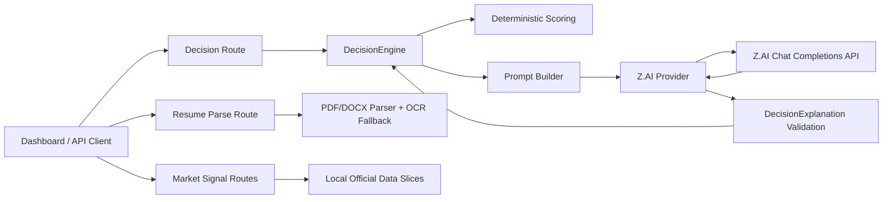
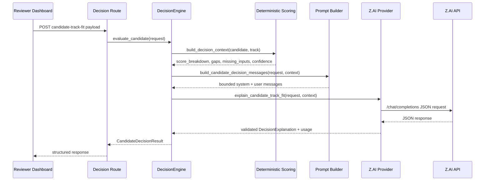

# ASEM Talint System Analysis Document (SAD)

Document version: 0.1  
Round: Preliminary  
Working status: Draft for PDF export

## 1. Introduction

### 1.1 Purpose

This system analysis document explains the technical scope, architectural decisions, data flow, model-service integration, and implementation boundaries of the ASEM Talint prototype.

The document is intended to help judges and technical reviewers answer four questions:

- what the system currently does
- where Z.AI GLM is used in the product path
- how deterministic logic and AI reasoning are separated
- whether the prototype is feasible to extend into a fuller training-allocation platform

### 1.2 Background

The product addresses a semiconductor talent-placement problem in which candidate readiness, missing evidence, geographic access, wage uplift, and employer demand should be considered together. The current system intentionally keeps scoring logic in code and delegates only structured explanation generation to Z.AI GLM.

Previous system version: `UNSPECIFIED`. This repository is the current preliminary-round prototype baseline.

### 1.3 Target Stakeholders

| Stakeholder | Role | Expectation |
| --- | --- | --- |
| Training reviewer | Reviews candidate fit for a track | Clear recommendation, missing inputs, and pathway steps |
| Program lead | Validates readiness and market relevance | Interpretable score breakdown plus wage and demand context |
| Employer-partnership team | Reviews OJT alignment | Ranked OJT roles with salary band and access notes |
| Development team | Implements and maintains the prototype | Clear provider boundary, typed models, and modular services |
| QA reviewer | Validates quality and failure handling | Reproducible tests for happy path, invalid input, provider failure, and AI contract handling |

## 2. System Architecture & Design

### 2.1 High Level Architecture

#### 2.1.1 Overview

| Layer | Implementation |
| --- | --- |
| Frontend surface | FastAPI-served browser dashboard |
| Backend API | FastAPI application with typed routes |
| Deterministic logic | Python domain scoring and service modules |
| Model service layer | Z.AI GLM via OpenAI-compatible provider client |
| Optional compatibility layer | ILMU OpenAI-compatible provider client, non-judge-path |
| Data storage in prototype | Local normalized CSV slices and request-time in-memory processing |
| Resume ingestion | PDF and DOCX parsing with optional OCR |

The application entry point assembles four route groups:

- dashboard routes
- decision routes
- resume routes
- market-signal routes

#### 2.1.2 LLM as Service Layer

Z.AI GLM is integrated as a concrete provider client behind a provider abstraction, not as a generic "AI module". The service boundary is explicit:

- deterministic context is computed first by `build_decision_context`
- prompt messages are constructed by `build_candidate_decision_messages`
- the provider sends a JSON-only chat-completions request
- the provider parses, validates, and returns a typed `DecisionExplanation`
- the `DecisionEngine` combines deterministic context and model output into the final API response

This separation keeps scoring, weights, missing-input detection, and confidence-baseline logic in code while reserving explanation generation for the model.

#### 2.1.3 Dependency Diagram

### 2.2 Sequence Flow

#### 2.2.1 Candidate-Track Fit Flow

#### 2.2.2 Resume Intake Flow

- user uploads a PDF or DOCX file
- the resume route enforces file-type and size rules
- direct text extraction runs first
- OCR fallback runs only when the direct PDF text is too weak
- PII is redacted in preview output
- the parser returns a compact `resume_context` object used in later decision requests

### 2.3 Technological Stack

| Area | Current choice | Reason |
| --- | --- | --- |
| Application framework | FastAPI | Typed REST API plus dashboard serving |
| Validation | Pydantic and pydantic-settings | Strict request, response, and environment contracts |
| Provider client | httpx | OpenAI-compatible chat-completions integration |
| Resume parsing | pypdf and python-docx | PDF and DOCX extraction |
| OCR fallback | pypdfium2 and rapidocr-onnxruntime | Image-only PDF handling |
| Test framework | pytest with FastAPI TestClient | Reproducible unit and integration validation |
| Prototype data layer | CSV slices under `data/official/` | Lightweight preliminary-round feasibility |

### 2.4 Key Data Flows

#### 2.4.1 Decision Data Flow

The decision payload includes:

- candidate profile
- target training track
- optional `resume_context`

The prompt builder transforms that into:

- candidate payload with truncated notes
- target-track payload
- deterministic context
- required response fields
- optional compacted `resume_evidence`

#### 2.4.2 Official Data Flow

The prototype reads normalized rows from:

- `data/official/wages_formal_mfg.csv`
- `data/official/employer_demand_semicon.csv`
- `data/official/semicon_hotspots.csv`

These slices support wage lookups, employer-demand filtering, hotspot accessibility, OJT matching, and wage-mobility estimates.

In the current dashboard implementation, hotspot accessibility is rendered as a compact SVG figure with numbered markers plus a separate ranked hotspot list, so spatial evidence remains readable in judge review and recorded demo conditions.

#### 2.4.3 Data Persistence

Persistent relational storage is `UNSPECIFIED` for the preliminary round. The current implementation relies on request-time computation plus local normalized CSV slices.

## 3. Functional Requirements & Scope

### 3.1 Minimum Viable Product

| ID | MVP capability | Current implementation evidence |
| --- | --- | --- |
| MVP-1 | Candidate-track fit decision | `POST /v1/decisions/candidate-track-fit` |
| MVP-2 | Dashboard-first review surface | `/` and `/dashboard` |
| MVP-3 | Resume ingestion with OCR fallback | `POST /v1/resumes/parse` |
| MVP-4 | Market context signals | wage, employer-demand, accessibility, OJT, and wage-mobility routes |
| MVP-5 | Typed AI-output contract | `DecisionExplanation` validation plus provider usage metadata |

### 3.2 Non-Functional Requirements (NFRs)

- provider timeout is bounded by `ZAI_TIMEOUT_SECONDS`, currently 30 seconds by default
- live Z.AI output must be parseable into the required JSON contract
- resume uploads are capped at 2,000,000 bytes
- extracted resume text is truncated to a bounded parser limit
- prompt notes are truncated before provider calls
- provider usage captures request id, model, token counts where available, and latency in milliseconds

Production SLOs and scale targets remain `UNSPECIFIED` for the preliminary round.

### 3.3 Out of Scope / Future Enhancements

- multi-page cohort analytics and reviewer case management
- production authentication and user tenancy
- persistent operational database and audit trail
- automated ingestion scheduling with production observability
- full multilingual support and accessibility audits

## 4. Monitor, Evaluation, Assumptions & Dependencies

### 4.1 Technical Evaluation

The current technical evaluation approach is based on:

- integration tests for end-to-end API behavior
- provider tests for valid JSON, fenced JSON, invalid contracts, and retries
- resume parser tests for DOCX, PDF extraction, OCR fallback, and oversized uploads
- manual dashboard checks against a live local server

Grayscale rollout, A/B testing, and emergency rollback strategy for production are `UNSPECIFIED` because the current prototype is not yet deployed as a public service.

### 4.2 Monitoring

The current implementation monitors or exposes:

- provider readiness through `/health`
- request-time provider latency and token usage in API output
- parser warnings for truncation and OCR fallback
- explicit provider errors instead of silent fallback to another reasoning model

Centralized log aggregation, alerting, and production dashboards remain `UNSPECIFIED`.

### 4.3 Assumptions

- ASSUMPTION: the final recorded demo will run with a working Z.AI key and authorized model.
- ASSUMPTION: local official-data slices are sufficient to show preliminary feasibility.
- ASSUMPTION: a public repository link will be available before final submission.

### 4.4 External Dependencies

- Z.AI OpenAI-compatible API access
- optional ILMU OpenAI-compatible API access for non-judge-path compatibility only
- OpenDOSM wage-source ingestion inputs
- Python package dependencies for parsing, OCR, validation, and tests

## 5. Project Management & Team Contributions

### 5.1 Project Timeline

The current repository shows a compressed preliminary-round build sequence:

- application skeleton and provider abstraction
- dashboard and typed decision flow
- official-data ingestion slices and market panels
- resume parsing and OCR fallback
- optional ILMU compatibility route kept outside the judge path
- documentation and packaging for preliminary submission

Detailed day-by-day team planning is `UNSPECIFIED`.

### 5.2 Team Member Roles

Current preliminary-round team listing:

- Team: Novum
- Ong Khai Sern: team leader
- Tan Eng Feng: team member

Detailed workstream ownership mapping is still `UNSPECIFIED` in the repository and should be completed before PDF export.

### 5.3 Recommendations

- keep Z.AI GLM as the only judged reasoning path in every narrative artifact
- define a production persistence layer before expanding reviewer workflows
- formalize CI thresholds in a workflow file before final-round scaling claims
- publish the public repository URL only after citation review and secret scanning

## References

- [UMHackathon 2026 Official Handbook](../../UMHackathon%202026%20Official%20Handbook.pdf)
- [UMHakcathon2026 System Analysis Documentation (Sample)](../../UMHakcathon2026%20System%20Analysis%20Documentation%20%28Sample%29.pdf)
- [UMHackathon2026 Judging Criteria](../../UMHackathon2026%20Judging%20Criteria.pdf)
- [Project README](../../README.md)
- [Z.AI GLM Guide Book](../../UM%20Hackathon%202026%20Z.ai%20GLM%20Guide%20Book.pdf)
